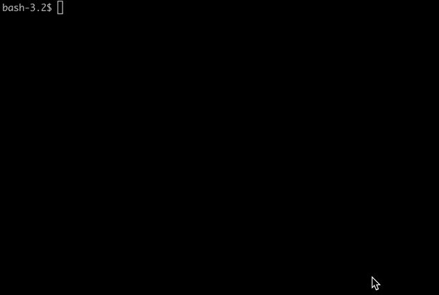

## :information_source: tiny-shell

Этот проект посвящен созданию простой командной оболочки.



Эта оболочка:
- отображает приглашение при ожидании новой команды;
- имеет историю команд;
- находит и запускает нужный исполняемый файл (на основе переменной PATH или с использованием относительного или абсолютного пути);
- осуществляет перенаправления:
    - < перенаправляет ввод
    - &#62; перенаправляет вывод
    - << указывает разделитель, затем считывает входные данные до тех пор, пока не появится строка, содержащая  разделитель
    - &#62;&#62; перенаправляет вывод в режиме добавления
- реализовывает каналы (| символ). Выходные данные каждой команды подключаются к входу следующей команды через канал.
- обрабатывает переменные среды ($, за которыми следует последовательность символов);
- обрабатывать переменную $?, которая принимает значение статуса выхода самой последней команды;
- обработывает ctrl-C, ctrl-D и ctrl-&#92;, которые ведут себя как в bash;
- в интерактивном режиме:
    - ctrl-C отображает новое приглашение ввода в новой строке
    - ctrl-D завершает работу оболочки
    - ctrl-&#92; ничего не делает
- реализовывает следующие встроенные функции:
    - echo с опцией -n
    - cd
    - pwd без каких-либо опций
    - export без опций
    - unset
    - env без параметров или аргументов
    - exit

## :hammer: Build

Чтобы собрать командную оболочку, склонируйте этот репозиторий и перейдите в директорию с проектом:

```
git clone https://github.com/zagaynov-andrew/tiny-shell.git && cd tiny-shell
```

Затем соберите командный интерпретатор:

```
make
```

:pushpin: Для успешной сборки вам понадобятся установленные GNU Make и библиотека readline.

## :rocket: Launch

Для запуска командной оболочки введите:

```
./tinyshell
```

или

```
bash tinyshell
```
